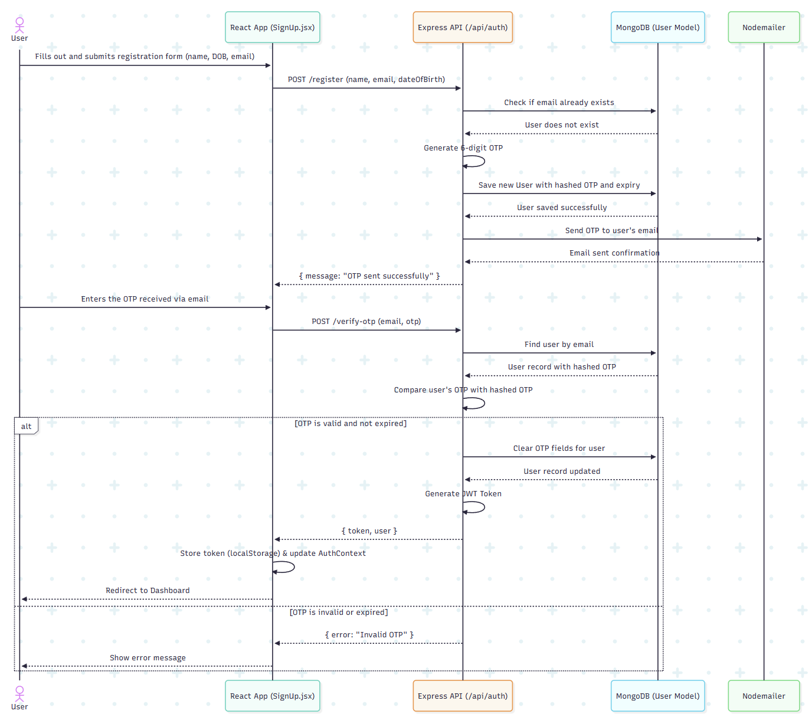

# 🛣️ HighwayD - Full Stack Note Management Application

[](https://highway-d.vercel.app)


A full-stack MERN application Built as an internship assignment for Highway Delite

## Assignment Requirements Fulfilled

| Task | Requirement | Status |
| :--- | :--- | :---: |
| 1 | **Email/OTP & Google Sign-up** | ✅ |
| 1a | Input Validation | ✅ |
| 2 | **Error & Success Messaging** | ✅ |
| 3 | **User Dashboard & Note Management (CRUD)** | ✅ |
| 4 | **Google Login** | ✅ |
| 5 | **Mobile-Responsive Design** | ✅ |
| 6 | **JWT Authorization for Notes API** | ✅ |
| 7 | Clear Build Instructions in README | ✅ |
| 8 | Deployed to Cloud with URL | ✅ |

## Local Installation

### Prerequisites

- Node.js 18+
- MongoDB Atlas account
- Google OAuth credentials

### Setup Steps

1. **Clone the repository**

   ```bash
   git clone https://github.com/AyanB-dev/highwayD.git
   cd highwayD
   ```

2. **Install dependencies**

   ```bash
   npm install
   ```

3. **Environment Configuration**

   Create `.env` in root (for frontend):

   ```env
   VITE_GOOGLE_CLIENT_ID=your_google_client_id
   ```

   Create `api/.env` (for backend):

   ```env
   MONGO_URI=your_mongodb_connection_string
   JWT_SECRET=your_jwt_secret
   EMAIL_HOST=smtp.gmail.com
   EMAIL_USER=your_email@gmail.com
   EMAIL_PASS=your_app_password
   GOOGLE_CLIENT_ID=your_google_client_id
   NODE_ENV=development
   ```

4. **Start the application**

   **Option A: Development Mode (Recommended)**

   ```bash
   # Terminal 1: Start backend server
   npm run server
   
   # Terminal 2: Start frontend development server
   npm run dev
   ```

   **Option B: Production Mode**

   ```bash
   # Terminal 1: Start backend server
   npm start
   
   # Terminal 2: Build and preview frontend
   npm run build
   npm run preview
   ```

5. **Access the application**

   - Frontend: <http://localhost:5173> (Vite dev server)
   - Backend API: <http://localhost:3000> (Express server)

6. **Build for production**

   ```bash
   npm run build
   ```

## Application Architecture

### System Flow



### Database Schema


## Technology Stack

**Frontend:** React 18, Vite, Tailwind CSS, React Router  
**Backend:** Node.js, Express.js, MongoDB, Mongoose  
**Authentication:** JWT, Google OAuth, Email OTP  
**Deployment:** Vercel (Frontend & Serverless Functions), MongoDB Atlas  
**Additional:** React Hot Toast, Joi Validation, Nodemailer

## Key Features

- **Dual Authentication**: Email OTP and Google OAuth integration
- **Smart Routing**: Automatic detection of registration method
- **Real-time Validation**: Form validation with instant feedback
- **Responsive Design**: Mobile-first approach with Tailwind CSS
- **Toast Notifications**: Success/error messaging system
- **JWT Security**: Protected API routes with token authentication
- **Cloud Deployment**: Production-ready deployment on Vercel

---

**Built by Ayan Biswas** | [Live Demo](https://highway-d.vercel.app) | [LinkedIn](https://linkedin.com/in/ayanbiswas)
